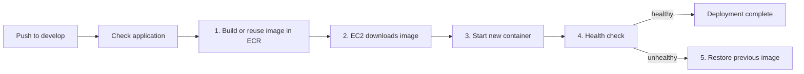

# Development deployment pipeline

The workflow in [workflows/deploy-dev.yml](workflows/deploy-dev.yml) runs after
a push to `develop`. It deploys the exact commit SHA to the development EC2
host without SSH.

Keep this document synchronized with the numbered stages in the workflow.

The GitHub `dev` environment stores stable identifiers only: `AWS_REGION`,
`ECR_REPOSITORY_URL`, `SSM_RUNTIME_ENV_PARAMETER`, and
`SSM_DEPLOYMENT_TARGET_PARAMETER`. Terraform updates the latter parameter with
the current EC2 ID whenever it replaces the host; GitHub never stores that
mutable ID directly.

## Before the numbered stages

GitHub checks out the commit, validates the required `dev` environment
variables, runs lint/typecheck/build, and obtains temporary AWS credentials
through OIDC. It then reads the current deployment target from Parameter Store.
No permanent AWS key or mutable EC2 ID is stored in GitHub.

## 1. Build or reuse the immutable image

The image is identified by the commit SHA. The workflow first checks ECR:

- If that image already exists, such as after a failed deployment retry, it is
  reused without another Docker build or push.
- If it does not exist, GitHub builds it and pushes it to the private ECR
  repository.

This preserves immutable image tags while allowing a deployment retry.

## 2. EC2 downloads the image

GitHub sends a controlled command through Systems Manager. The EC2 host reads
its runtime env-file from Parameter Store, authenticates Docker to ECR with its
own Instance Role, and downloads the selected SHA-tagged image.

## 3. Start the new container

The host removes the current `caged-frontend-next` container and starts the new
image on `127.0.0.1:3000`. Nginx remains the only process that receives origin
traffic and proxies it to this local port.

## 4. Health check

The host calls `GET /health` from inside the new container. It retries for up
to one minute and expects `{ "status": "ok" }` from Next.js.

## 5. Rollback when needed

If the health check fails, the host removes the failed container and starts the
previous local image again. The GitHub workflow still reports failure, so the
failed release can be investigated without silently presenting it as deployed.
